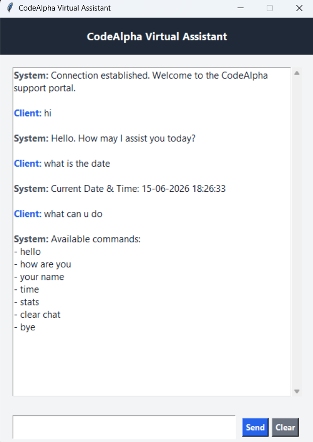

# CodeAlpha Virtual Assistant

## 📌 Overview

CodeAlpha Virtual Assistant is a GUI-based chatbot developed using Python and Tkinter. The application simulates a professional virtual assistant capable of handling common user queries through predefined responses and intelligent text matching.

This project demonstrates the use of Python programming concepts such as Object-Oriented Programming (OOP), GUI development, event handling, and fuzzy string matching to create an interactive desktop application.

---

## 🚀 Features

* Modern Graphical User Interface (GUI)
* Interactive chat window
* Professional virtual assistant responses
* Fuzzy text matching for typo handling
* Date and time information
* Chat statistics tracking
* Clear chat functionality
* Keyboard Enter key support
* Automatic scrolling chat history
* Session termination through exit commands

---

## 🛠 Technologies Used

* Python 3
* Tkinter
* ScrolledText Widget
* Object-Oriented Programming (OOP)
* Difflib (SequenceMatcher)
* Datetime Module
* Event-Driven Programming

---

## 📂 Project Structure

```text
CodeAlpha-Virtual-Assistant/
│
├── VirtualAssistant.py
├── README.md
└── screenshot.png
```

---

## ⚙️ How It Works

1. The application launches a graphical chat interface.
2. Users enter messages through the input field.
3. The assistant analyzes user input using pattern matching and fuzzy matching algorithms.
4. Relevant responses are generated from the predefined knowledge base.
5. The conversation is displayed in the chat window.
6. Users can request help, check system status, view date and time, clear chat history, or end the session.

---

## 💡 Supported Commands

| User Input  | Assistant Response  |
| ----------- | ------------------- |
| hello       | Greeting message    |
| hi          | Greeting message    |
| how are you | System status       |
| your name   | Assistant identity  |
| help        | Available commands  |
| time        | Current time        |
| date        | Current date        |
| stats       | Message statistics  |
| clear chat  | Clears chat history |
| bye         | Ends session        |

---

## 🖥️ Sample Interaction

```text
Client: hello

System: Hello. How may I assist you today?

Client: time

System: Current Date & Time: 15-06-2026 18:30:00

Client: stats

System: Messages processed: 5

Client: bye

System: Goodbye. Have a productive day.
```

---

## 📸 Project Preview

Add a screenshot of the running application:

```md

```

---

## ▶️ Installation & Execution

### Step 1: Clone Repository

```bash
git clone https://github.com/akilan-27/CodeAlpha-Python-Internship.git
```

### Step 2: Navigate to Project Folder

```bash
cd CodeAlpha-Virtual-Assistant
```

### Step 3: Run the Application

```bash
python VirtualAssistant.py
```

---

## 📚 Concepts Learned

* Python GUI Development
* Object-Oriented Programming
* Event Handling
* User Interface Design
* String Similarity Algorithms
* Chatbot Development Fundamentals
* Desktop Application Development

---

## 🔮 Future Enhancements

* Voice Input and Output
* AI-Powered Responses
* Database Integration
* User Authentication
* Dark Mode Theme
* Chat History Export
* Multi-Language Support

---

## 🎯 Internship Task

This project was developed as part of the **CodeAlpha Python Programming Internship**.

**Task Completed:** Basic Chatbot (Enhanced GUI Version)

---

## 👨‍💻 Author

**R. Akilan**

B.Tech – Artificial Intelligence and Data Science

Kalaignar Karunanidhi Institute of Technology (KIT), Coimbatore

Python Programming Intern – CodeAlpha

GitHub: https://github.com/akilan-27

---

⭐ If you found this project useful, consider giving the repository a star.
