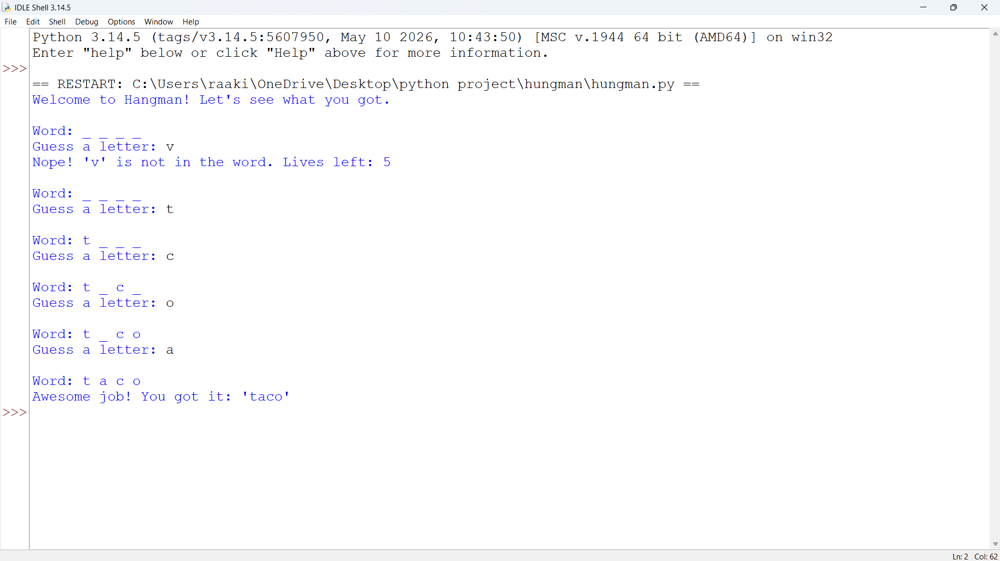

# 🎯 Hangman Game

A fun and interactive text-based **Hangman Game** built using **Python**. The game challenges players to guess a hidden word one letter at a time before exhausting their available attempts.

This project was developed to strengthen core Python programming concepts such as loops, conditionals, string manipulation, user input handling, and randomization.

---

## 📖 Overview

Hangman is a classic word-guessing game where players attempt to uncover a randomly selected word by guessing individual letters.

The player wins by revealing the entire word before running out of attempts. Incorrect guesses reduce the number of remaining chances.

---

## ✨ Features

* 🎲 Random word selection
* ⌨️ Letter-by-letter guessing
* ❤️ Limited incorrect attempts
* 🔄 Dynamic word updates
* 🏆 Win and loss detection
* 🚫 Duplicate guess prevention
* 🖥️ Simple and user-friendly console interface

---

## 🛠️ Technologies Used

| Technology        | Purpose                   |
| ----------------- | ------------------------- |
| Python            | Core Programming Language |
| Random Module     | Random Word Selection     |
| Console Interface | User Interaction          |

---

## ⚙️ How It Works

1. A random word is selected from a predefined list.
2. The hidden word is displayed using underscores (`_`).
3. The player guesses one letter at a time.
4. Correct guesses reveal matching letters.
5. Incorrect guesses reduce the remaining attempts.
6. The game continues until:

   * The word is completely guessed, or
   * The player runs out of attempts.

---

## 🔄 Workflow

```text
Start Game
    ↓
Select Random Word
    ↓
Display Hidden Word
    ↓
User Guesses Letter
    ↓
Check Guess
    ↓
Correct? ── Yes ──► Reveal Letter
    │
    No
    ↓
Reduce Attempts
    ↓
Word Completed?
    │
   Yes ──► Player Wins
    │
    No
    ↓
Attempts Remaining?
    │
   Yes ──► Continue
    │
    No
    ↓
Player Loses
    ↓
End Game
```

---

## 📚 Concepts Demonstrated

* Variables
* Lists
* Strings
* Loops
* Conditional Statements
* Functions
* User Input Handling
* Random Module
* Game Logic Design

---

## 💻 Sample Gameplay

```text
Welcome to Hangman!

Word: _ _ _ _ _

Guess a letter: a

Correct!

Word: a _ _ _ _

Guess a letter: z

Wrong Guess!
Attempts Left: 5

Guess a letter: p

Correct!

Word: a p p _ _
```

---

## 🚀 Installation & Usage

### Clone the Repository

```bash
git clone https://github.com/yourusername/CodeAlpha_HangmanGame.git
```

### Navigate to the Project Directory

```bash
cd CodeAlpha_HangmanGame
```

### Run the Program

```bash
python hangman.py
```

---

## 📂 Project Structure

```text
CodeAlpha_HangmanGame/
│
├── hangman.py
├── README.md
└── screenshot.png
```

---

## 📸 Project Preview

Add a screenshot of the game output:

```md

```

---

## 🎯 Learning Outcomes

Through this project, I gained practical experience in:

* Python Fundamentals
* Problem Solving
* Game Development Logic
* Randomized Program Behavior
* Input Validation
* Control Flow Management
* Debugging and Testing

---

## 🔮 Future Enhancements

* Difficulty Levels (Easy, Medium, Hard)
* Expanded Word Database
* Score Tracking System
* Timer-Based Gameplay
* Graphical User Interface (Tkinter)
* Multiplayer Mode
* Sound Effects
* Leaderboard Integration

---

## 💼 Internship Project

This project was developed as part of the **CodeAlpha Python Programming Internship** to demonstrate Python fundamentals, game logic implementation, and problem-solving skills.

---

## 👨‍💻 Author

**R. Akilan**

B.Tech – Artificial Intelligence and Data Science

Kalaignar Karunanidhi Institute of Technology (KIT), Coimbatore

GitHub: https://github.com/akilan-27/

---

⭐ If you found this project useful, consider giving the repository a star!
