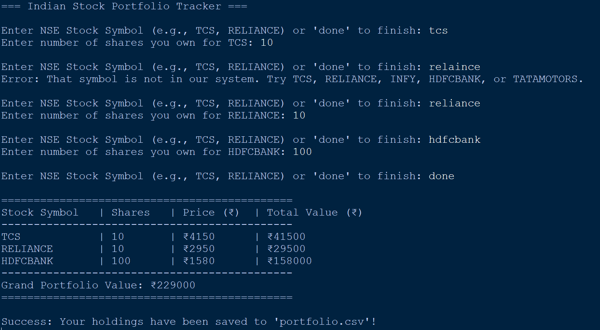

# 📈 Stock Portfolio Tracker

A Python-based Stock Portfolio Tracker that allows users to manage their stock investments by entering stock symbols and quantities. The application calculates the total investment value using predefined stock prices and exports the portfolio data to a CSV file for record-keeping and analysis.

---

## 🚀 Features

* Add stock symbols and quantities
* Calculate individual stock investment values
* Generate a complete portfolio summary
* Calculate total investment value
* Export portfolio data to a CSV file
* Simple and user-friendly console interface

---

## 🛠️ Technologies Used

* Python 3
* Dictionaries
* Loops and Conditional Statements
* File Handling
* CSV Module

---

## 📂 Project Structure

```text
CodeAlpha_StockPortfolioTracker/
│
├── stock_tracker.py
├── portfolio.csv
├── README.md
└── screenshot.png
```

---

## ⚙️ How It Works

1. The user enters stock symbols.
2. The user specifies the quantity owned for each stock.
3. The program retrieves stock prices from a predefined dictionary.
4. Investment values are calculated automatically.
5. A portfolio summary is displayed.
6. Portfolio data is exported to a CSV file.

---

## 📋 Example Input

```text
Enter stock symbol: AAPL
Enter quantity: 5

Enter stock symbol: TSLA
Enter quantity: 2

Enter stock symbol: DONE
```

---

## 📊 Example Output

```text
===== Portfolio Summary =====

AAPL : 5 x $180 = $900
TSLA : 2 x $250 = $500

Total Investment Value = $1400

Portfolio saved to portfolio.csv
```

---

## 📄 Sample CSV Output

```csv
Stock,Quantity,Price,Value
AAPL,5,180,900
TSLA,2,250,500

Total Investment Value,1400
```

---

## ▶️ How to Run

### Clone the Repository

```bash
git clone https://github.com/yourusername/CodeAlpha_StockPortfolioTracker.git
```

### Navigate to the Project Folder

```bash
cd CodeAlpha_StockPortfolioTracker
```

### Run the Program

```bash
python stock_tracker.py
```

---

## 🎯 Learning Outcomes

This project helped me gain hands-on experience with:

* Python Dictionaries
* Loops and Conditional Logic
* User Input Handling
* CSV File Operations
* Data Processing and Calculation
* Basic Financial Application Development

---

## 🔮 Future Enhancements

* Real-time stock prices using financial APIs
* Portfolio profit/loss tracking
* Investment performance analytics
* Graphical User Interface (GUI) using Tkinter
* Database integration for portfolio storage
* Portfolio visualization with charts and graphs

---

## 📸 Project Preview

Add screenshots of the program output here:

```md

```

---

## 💼 Internship Project

This project was developed as part of the **CodeAlpha Python Programming Internship** to demonstrate the use of Python for financial calculations, data processing, and file management.

---

## 👨‍💻 Author

**Your Name**

Python Programming Intern – CodeAlpha

GitHub: https://github.com/akilan-27/
